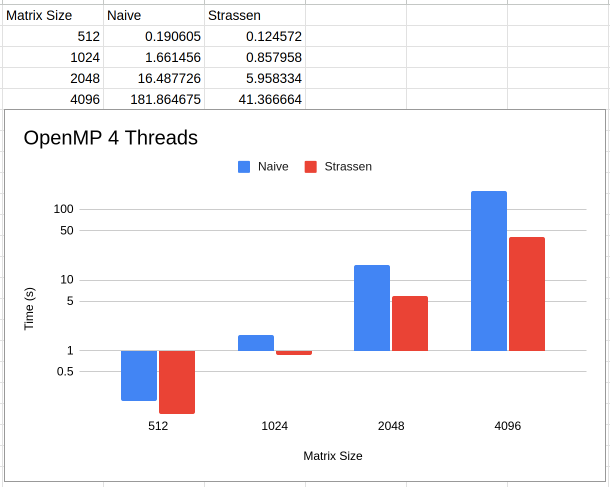

# A comparison of O(N^3) and O(N^2.81) parallel matrix multiplication algorithms
Parallel implementations written with OpenMP and CUDA. Tested on Intel(R) Xeon(R) 6148, 80 Cores @ 2.40GHz and Nvidia Tesla K80, 2496 CUDA Cores. GCC Version 8.5.0, NVCC Version 10.1.243 
## Benchmarks
 
 
 
 
 
 
 
 
 
 
 
 
## Findings
For CUDA implementations, if the number of threads exceeds the matrix size, an error occurs resulting in zeroes to fill the product matrix. 
If available computing power and number of threads are small, strassen is preferred over naive. 
If available computing power and number of threads are large, such as a many core CPU or a GPU, naive is preferred over strassen. The number of workers far overpowers the smarter, less time complex approach. 
## Dumber, but faster